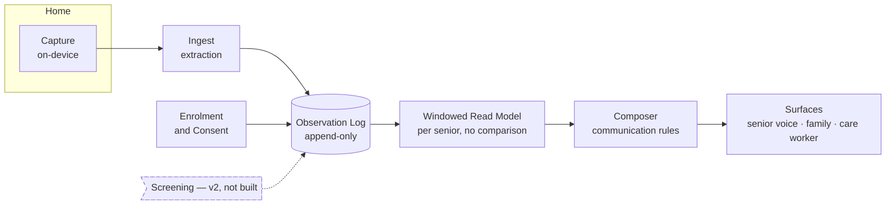
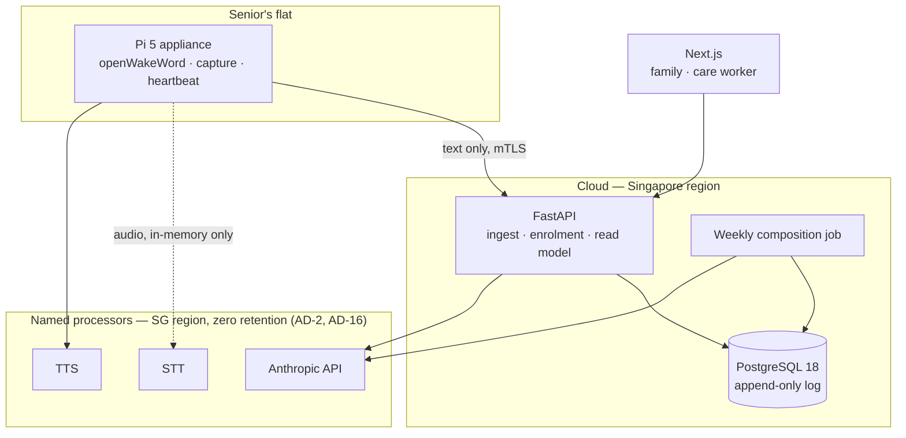
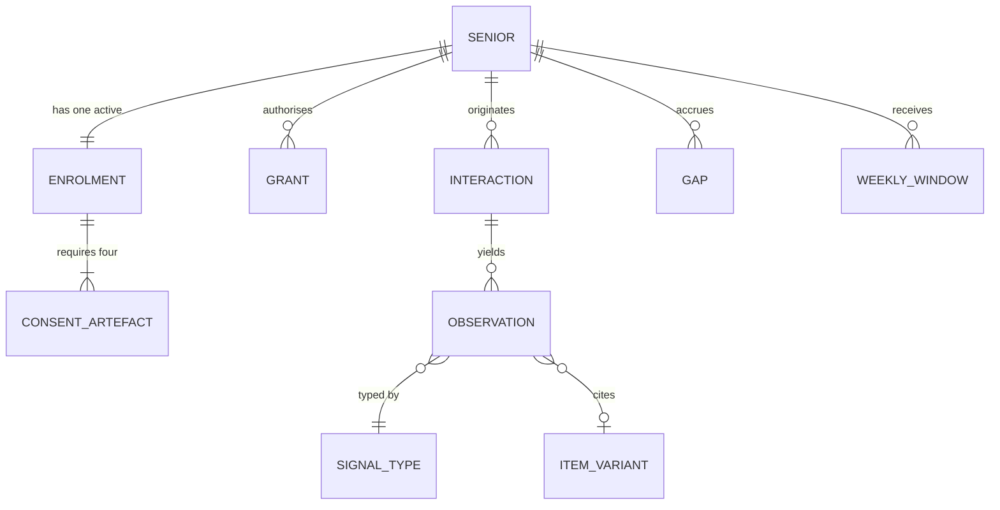

# Architecture Spine — cognitive-change-companion

## Design Paradigm

**Ports and adapters (hexagonal), wrapped around an append-only observation log, fed by a strictly one-way capture pipeline.**

The two guarantees this product actually sells — audio is never kept and never reaches a party she was not told about, and v1 renders no judgement — are structural. Written as coding conventions they last until the first person in a hurry. Written as dependency directions and egress policy they hold.

Four bounded contexts, and the dependency arrows between them are themselves a rule (AD-3):



Layer-to-namespace map:

| Layer | Namespace |
| --- | --- |
| Domain (entities, rules, policies) | `core/` |
| Ports (interfaces the domain owns) | `core/ports/` |
| Adapters (STT, TTS, LLM, DB, notification) | `adapters/` |
| Application services (use cases) | `app/` |
| Delivery (HTTP, device agent, jobs) | `edge/` |

Adapters depend on `core`; `core` depends on nothing.

## Invariants & Rules

### AD-1 — The observation log is append-only and is the single source of truth

- **Binds:** CAP-4, CAP-2, CAP-3, CAP-8, all
- **Prevents:** Two components disagreeing about the series; retroactive rewriting that destroys the evidentiary value the screening layer depends on.
- **Rule:** Every fact derived from a senior is written as an immutable, dated `Observation` event. No update-in-place, no delete. Corrections are new events that supersede, never edits. Any read model is derived and disposable.

### AD-2 — Audio is never persisted, and never reaches an unnamed party

- **Binds:** CAP-1, CAP-2, CAP-3, CAP-9
- **Prevents:** Raw audio reaching application stores, log aggregators, backups, or persisted model prompts — the failure that would break both the consent model and CAP-9 at once — and audio reaching any organisation the senior was never told about.
- **Rule:** Audio is never written to durable storage anywhere in the system, on the device or off it. It exists only in memory, only for the duration of one turn's transcription, and is destroyed at the end of that turn. The one exception is her enrolment consent recording, which is a deliberate durable artefact under AD-13.
- **Rule (named processors):** Audio may transit to a speech processor only if that processor is named in her enrolment consent artefact, contracted for zero retention and no training use, hosted in the Singapore region, and enumerable by the AD-13 erasure path. A processor not on that list cannot be called; the allowlist is configuration validated at boot, not a code convention. Adding a processor is a consent change, not a deployment change — it requires re-consent, because she agreed to a named set of parties and not to a category.
- **Rule (enforcement):** This invariant is about network egress, so it is tested as network egress. The device denies all outbound destinations except the allowlist, and the test that guards AD-2 asserts on the egress policy, not on namespace imports — a dependency-direction test cannot see a socket.

### AD-3 — No judgement: dependency direction, not discipline

- **Binds:** CAP-4, CAP-5, CAP-10, all
- **Prevents:** A well-meaning dashboard feature computing a trend, a badge, or an ordering, and thereby shipping an unregulated screening product.
- **Rule:** No v1 component may read the observation log in a way that compares, aggregates, orders, scores, or thresholds across entries. Surfaces read only the windowed read model, whose API exposes no comparison, ranking, or aggregate primitive. Cross-entry analysis lives behind a port that has no v1 implementation.
- **Rule (scope of the wall):** AD-3 binds *every* v1 component, not only log readers — on-device extraction and cloud ingest included. Comparison across interactions is prohibited wherever it would run, and the architecture test asserts this at each of the three sites rather than at the read model alone.
- **Rule (comparative signals):** Several entries in `signal-catalog.md` are comparative by construction — "repeating a question across days", "increasing reliance", "falling off a familiar routine". v1 records their non-comparative substrate (the question asked, its topic, the date; the task and its outcome) and never the comparison itself. The signal is reconstructible by the screening layer from the substrate; it is not computed here.
- **Carve-out:** The SPEC's operating metrics — task completion and the human-contact counter-metric — are aggregates by nature and are therefore computed in a separate programme-evaluation projection, at cohort level only, never per named senior, and never reachable from any surface a senior, family member, or care worker sees. A per-senior view of either metric is the screening layer wearing a different hat.

### AD-4 — Consent is a write-path precondition

- **Binds:** CAP-7, CAP-4, CAP-9
- **Prevents:** Partial enrolments quietly collecting data; each surface re-implementing the consent check slightly differently.
- **Rule:** The log rejects any observation for a senior without an active enrolment carrying all four artefacts (own-voice Ulysses instruction, recipient co-signature, research consent, processor disclosure acknowledged). The check lives in the log's write path, not in any caller. There is no bypass, test flag included.

### AD-5 — Addressed-turn determination happens on-device, before egress

- **Binds:** CAP-1
- **Prevents:** Cloud-side filtering, which would mean unaddressed audio — a visiting helper, a TV, a phone call — had already left the home.
- **Rule:** Wake and address detection run entirely in the Capture context. A turn that fails address detection produces no network call of any kind, including telemetry.
- **Rule (third parties):** Address detection is necessary but not sufficient, because non-consenting people appear inside consented turns. Co-present speech captured during an addressed turn is discarded at the device before egress and never transcribed. A false accept is treated as an unaddressed turn the moment it is detected, and its buffer destroyed. Third parties the senior names or describes in her own speech are redacted to role before any observation is written — the record may hold "her daughter", never a named person who never consented. Voice delivery of the weekly disclosure (CAP-6) is a disclosure into a room that may hold visitors, so it is spoken only on her explicit request, never unprompted.

### AD-6 — Liveness is a separate series from interaction

- **Binds:** CAP-8, CAP-4
- **Prevents:** A dead unit — or a unit that cannot understand this particular senior — reading as a withdrawn senior. Phantom decline, the failure that would discredit the record.
- **Rule:** Device heartbeats are their own event stream. Any period without a heartbeat is written to the observation series as an explicit `Gap`, and the windowed read model must exclude gap periods rather than render them as absence of activity. Recognition failure is a `Gap` of its own kind: a turn the senior addressed to the device that STT could not resolve is recorded as `Gap(reason=unrecognised)`, never as silence and never as a failed task. Sustained unrecognised turns are an operational alert to the care worker, not an observation about her.

### AD-7 — One owner per entity

- **Binds:** CAP-7, CAP-10, CAP-5
- **Prevents:** Two writers of the same person, and the divergent senior records that follow.
- **Rule:** The Enrolment context solely owns the `Senior` record. Family members and care workers are not entities but `Grant`s against a senior, each carrying a role, a scope, and the consent clause that authorises it. No other context writes a `Senior`.

### AD-8 — One Composer for all human-facing text

- **Binds:** CAP-5, CAP-6, CAP-10
- **Prevents:** Forbidden vocabulary ("Stable", any clinical term, any score) appearing on one surface because that surface built its own copy.
- **Rule:** Every string a senior, family member, or care worker reads or hears is produced by the Composer, which applies `communication-rules.md` and rejects violations as errors rather than warnings. Surfaces render Composer output; they never assemble their own. The senior-facing and family-facing renderings of a given week derive from the same Composer call (CAP-6).
- **Rule (comparison containment):** The Composer is given exactly one window's entries and no prior window, no baseline, and no counts from any other period — it cannot compare what it cannot see. Its output additionally passes a deterministic comparative-construction check that rejects longitudinal phrasing ("fewer than", "less often than", "used to", "no longer", "compared with") before any human receives it. Per AD-12, the prompt is not what stands between the Composer and a judgement; the input window and the output check are.

### AD-9 — Single instrument scheduler

- **Binds:** CAP-3
- **Prevents:** Two schedulers double-administering an item, destroying the rotation guarantee and reintroducing the practice effect the whole protocol exists to defeat.
- **Rule:** Item selection and refractory-window eligibility are computed in exactly one service. Bank exhaustion returns "no eligible item" and the omission is logged; it never falls back to a repeat.

### AD-10 — Every observation carries provenance

- **Binds:** CAP-4, CAP-3, CAP-5
- **Prevents:** Entries no one can cite — worthless to the screening layer and unusable in the weekly window's "one specific dated detail".
- **Rule:** Each `Observation` records the interaction it came from, its date, its signal type per `signal-catalog.md`, and the item-bank variant where one applies. An observation without provenance is rejected at write.

### AD-11 — UTC storage, Singapore windowing

- **Binds:** CAP-4, CAP-5, CAP-8
- **Prevents:** Day-boundary drift silently corrupting a series whose whole value is day resolution.
- **Rule:** All timestamps are stored as UTC ISO-8601. All day, week, and window arithmetic is computed in `Asia/Singapore`. No local-time value is ever persisted.

### AD-12 — The model is an adapter, never the policy

- **Binds:** all
- **Prevents:** Consent, eligibility, redaction, or communication rules being enforced by prompt text, where they are nondeterministic and untestable.
- **Rule:** The LLM sits behind a port in `core/ports/`. Consent gating (AD-4), item eligibility (AD-9), the audio boundary (AD-2), and Composer rule enforcement (AD-8) are deterministic code with unit tests. A prompt may shape tone; it may never be the only thing standing between the system and a rule violation.

### AD-13 — Erasure by crypto-shredding, not deletion

- **Binds:** CAP-9, CAP-7
- **Prevents:** The deadlock between AD-1's append-only log and the withdrawal and death obligations in `consent-and-data-governance.md` — discovered, otherwise, on the day someone withdraws.
- **Rule:** Each senior's observation payloads are encrypted under a per-senior key. Withdrawal or death destroys the key and appends a tombstone event. The log's structure survives; the content becomes unrecoverable.
- **Rule (custody):** Keys live in a dedicated key-management service, never in the application database and never inside any artefact that reaches a backup. A key store that is itself backed up makes the whole guarantee decorative, so backup exclusion is a tested property, not an operational habit.
- **Rule (reach):** Shredding covers every store holding her content — the log payloads, the derived read model, rendered weekly windows, notification payloads, any vendor-side prompt retention, her enrolment consent audio, and the research projection. A derived store that survives a shred is a leak, so every projection is registered at build time and the shred path iterates that registry rather than a hand-maintained list. No processor may be used whose contract does not permit deletion on request within a stated period, and the enrolment record names each processor holding her data so the erasure path is enumerable rather than remembered.
- **Rule (research projection):** The de-identified research projection is written at ingest only when she chose de-identified retention at enrolment. Where she chose removal, no projection is written in the first place — a projection cannot be un-derived later.

### AD-14 — The Capture→Ingest seam has one owner and one shape

- **Binds:** CAP-1, CAP-2, CAP-4, CAP-8
- **Prevents:** Two teams each obeying AD-2 while splitting extraction differently — one on-device, one in cloud — and a retry silently manufacturing a Memory signal by writing the same interaction twice.
- **Rule:** The device mints the `Interaction`: it owns the id (UUIDv7), the occurred-at timestamp, and the idempotency key. Ingest is idempotent on that key and never mints one. Extraction runs in exactly one of the two contexts, named in the stack, never split across them. The device clock is authoritative for occurred-at and is disciplined by NTP with drift recorded; server receipt time is stored separately and is never used for windowing (AD-11).

### AD-15 — Extraction is versioned, and its version is part of the record

- **Binds:** CAP-3, CAP-4, CAP-10
- **Prevents:** The most dangerous silent failure available to this product — a mid-baseline model or prompt change shifting extraction behaviour in a way indistinguishable from decline, and unrecoverable after the fact because nothing recorded which version produced which entry.
- **Rule:** Every `Observation` records the extraction model id, prompt version, and STT model version that produced it. Extraction models and prompts are pinned and changed only by an explicit versioned migration, never by a floating alias. A version change is written to the log as an event on every affected senior's series, so downstream can see the seam. No LLM call anywhere in extraction uses a non-pinned model.

### AD-16 — Every processor is disclosed, contracted, and enumerable

- **Binds:** CAP-7, CAP-9, CAP-1
- **Prevents:** The gap between the three parties her consent artefact names and the three vendors that actually hold her data; and an erasure path that cannot reach what it does not know exists.
- **Rule:** Every external processor touching her data — speech-to-text, text-to-speech, the LLM — is listed in her enrolment record by name and purpose, disclosed to her in the enrolment script and acknowledged by her there; that acknowledgement is recorded as the fourth enrolment artefact (AD-4) in the same sitting as the Ulysses instruction. Each processor is contracted for zero retention and no training use, and registered in the erasure path (AD-13). Cross-border transfer of her data requires a PDPA Transfer Limitation basis recorded against that processor. The controller is the community care organisation; every vendor in this list is an intermediary, and the architecture must not blur the two.

## Consistency Conventions

| Concern | Convention |
| --- | --- |
| Naming | Domain entities singular PascalCase (`Senior`, `Observation`, `Grant`, `Enrolment`, `Interaction`, `Gap`). Events past-tense (`ObservationRecorded`, `HeartbeatMissed`). Never `Patient`, `Score`, `Level`, `Risk`, `Flag` — banned in code as they are in copy. |
| Ids | UUIDv7 everywhere, prefixed by type in logs (`snr_`, `obs_`, `int_`). Never a sequential integer for a senior. |
| Dates | UTC ISO-8601 in storage and on the wire; `Asia/Singapore` for all windowing (AD-11). |
| Errors | Rule violations (AD-4, AD-8, AD-10) raise typed domain errors and fail the write. Never a warning, never a log-and-continue. |
| Logging | Structured JSON, senior referenced by id only. No transcript text, no observation content, no audio, ever, at any level. |
| Config | Environment-injected, validated at boot with Pydantic Settings. A missing consent-enforcement or retention setting is a boot failure, not a default. |
| Auth | Care worker and family authenticate on the phone surface; the senior never authenticates (CAP-1). Grants are checked in `app/`, not in the delivery layer. |
| Tests | Every AD has at least one test that fails when the rule is broken. AD-2 is tested as egress policy (allowlist enforcement and no-durable-audio), never as an import graph. AD-3 gets a dependency-direction test at all three sites it binds: device, ingest, read model. |

## Stack

Seed — verified current 2026-09-08. The code owns this once it exists.

| Name | Version |
| --- | --- |
| Python | 3.13 (3.14 available; 3.13 pinned for adapter maturity) |
| FastAPI | 0.141.1 |
| SQLAlchemy | 2.0.52 |
| Alembic | 1.19.2 |
| asyncpg | 0.31.0 |
| PostgreSQL | 18.6 |
| Next.js (family + care worker surfaces) | 16.3.4 |
| Anthropic API — Claude Sonnet 5 (`claude-sonnet-5`) turn handling; Claude Opus 5 (`claude-opus-5`) weekly composition | current |
| STT — **undecided**, see Deferred `[ASSUMPTION]` | — |
| ElevenLabs — TTS `[ASSUMPTION]` | current |
| Address detection — on-device, custom `[ASSUMPTION]` | — |
| Raspberry Pi 5, 8GB + far-field USB mic array `[ASSUMPTION]` | — |

Anthropic ships no speech-to-text or text-to-speech API — verified two ways, including the full endpoint list — so voice is necessarily a three-stage pipeline rather than speech-to-speech. This is a constraint, not a preference.

Three vendor cautions that outrank version numbers:

- **Deepgram Nova-3 Multilingual cannot transcribe this population.** Its code-switching mode covers English, Spanish, French, German, Hindi, Russian, Portuguese, Japanese, Italian and Dutch. Mandarin, Malay, Tamil, Hokkien, Cantonese and Singlish are absent — precisely the speech this product exists to hear. It is removed from the stack, not deferred into it.
- **Deepgram Flux performs turn detection cloud-side**, which would violate AD-5 and AD-2 if adopted without change. Any vendor whose turn-taking runs off-device is disqualified by AD-5 regardless of its accuracy.
- **MERaLiON-AudioLLM's commercial API is announced, not confirmed GA.** Treat availability as unverified until someone has a key in hand.

`[ASSUMPTION]` Address detection is written as openWakeWord in most reference builds, but openWakeWord does wake-word spotting, not the addressed-versus-overheard determination AD-5 requires, and its last release was February 2024. AD-5 needs a purpose-built component; the choice is open.

## Structural Seed

Deployment and environments:



Core entities:



Source tree:

```text
cognitive-change-companion/
  core/            # entities, rules, policies — depends on nothing
    ports/         # interfaces the domain owns (LLM, STT, TTS, log, clock)
  app/             # use cases: enrol, ingest, compose weekly, read window
  adapters/        # anthropic/ deepgram/ elevenlabs/ postgres/ notify/
  edge/
    api/           # FastAPI delivery
    device/        # Pi agent — mints Interaction (AD-14), owns egress allowlist (AD-2)
    jobs/          # weekly composition, heartbeat sweep, retention sweep
  web/             # Next.js family + care worker surfaces
  tests/
    architecture/  # egress-policy assertions (AD-2); dependency direction (AD-3)
```

## Capability → Architecture Map

| Capability | Lives in | Governed by |
| --- | --- | --- |
| CAP-1 addressed-only interaction | `edge/device/` | AD-2, AD-5, AD-14, AD-16 |
| CAP-2 everyday task support | `app/tasks/`, `core/` | AD-1, AD-10 |
| CAP-3 instrument delivery | `app/instruments/` | AD-9, AD-10, AD-12, AD-15 |
| CAP-4 longitudinal record | `core/`, `adapters/postgres/` | AD-1, AD-3, AD-10, AD-11, AD-14, AD-15 |
| CAP-5 weekly family window | `edge/jobs/`, `app/compose/` | AD-3, AD-8, AD-10 |
| CAP-6 continuous disclosure | `app/compose/`, `edge/device/` | AD-8 |
| CAP-7 enrolment and consent | `app/enrolment/` | AD-4, AD-7, AD-13, AD-16 |
| CAP-8 device liveness | `edge/jobs/`, `edge/device/` | AD-6 |
| CAP-9 data lifecycle | `adapters/postgres/`, `edge/jobs/` | AD-2, AD-13, AD-16 |
| CAP-10 care-worker roster | `web/`, `app/read/` | AD-3, AD-7, AD-8, AD-15 |

## Deferred

- **PDPA s16 and the Ulysses contract.** Singapore's PDPA gives a right to withdraw consent at any time, which a standing Ulysses instruction probably cannot extinguish — directly against the SPEC's locked "no veto at flag time". Open pending Singapore legal advice; no enrolment happens until it is answered, and nothing is built that assumes either answer.
- **The screening layer in full.** Out of scope by SPEC non-goal. The port exists with no v1 implementation; nothing else about it is decided here.
- **Cellular vs wifi, and the connectivity bill of materials.** Open in the SPEC. AD-6 holds either way, which is why the spine can wait.
- **Cloud provider and exact hosting region.** Blocked on the PDPA question in the SPEC; the deployment diagram fixes only that it is Singapore-resident.
- **STT and TTS vendor selection.** Decided by a bake-off on real elderly code-switched recordings, not from a spec sheet, and gated by AD-5 (no cloud-side turn detection) and by whatever AD-2 resolves to. AD-12's port makes the swap cheap, which is why it can wait — but it cannot wait past the AD-2 decision, which it partly determines.
- **Device bill of materials.** Raspberry Pi 5 pricing has risen sharply on the DRAM shortage, which matters for a one-appliance-per-home product and for the funder's per-unit answer that is already open in the SPEC.
- **Non-production environments and test data.** No senior data may exist outside production; what synthetic or consented-donor data fills dev and staging is an epic-level call, but the prohibition itself is AD-4's write path.
- **Secrets and key management**, including custody of the AD-13 per-senior keys. Named here so it is not silently skipped; the custody decision is load-bearing for whether AD-13's guarantee is real, and is taken with the hosting-region decision.
- **Language and dialect coverage.** Open in the SPEC, and it drives the vendor choice above.
- **Device provisioning, fleet update, and physical install.** Owned by the epic that builds the appliance; nothing at this altitude constrains two units incompatibly.
- **Observability and alerting stack.** Beyond the logging convention above, no independent builders diverge on it yet.
- **The demo slice.** Which capabilities get built for the near-term deadline is a sprint-planning call, not an architectural one. Every AD holds regardless of how much of v1 is built.
